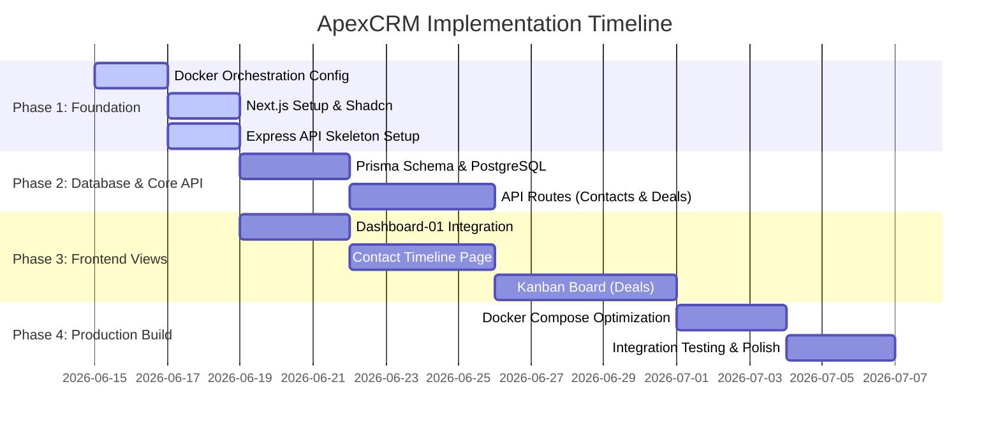

# ApexCRM: Roadmap & Feature Tracker

This document tracks the long-term roadmap and current status of all features and architectural components of ApexCRM.

---

## Project Overview
* **Status:** Phase 1 (Foundation & Containerization Setup)
* **Start Date:** June 15, 2026
* **Target Version:** v1.0.0

---

## 🗺️ Master Roadmap

---

## 📈 Feature Tracker

### Phase 1: Foundation & Containerization Setup
- [x] **1.1. Docker Compose Configuration**
  - [x] Create root `docker-compose.yml` linking frontend, backend, and postgres services.
  - [x] Configure root `.env` for database credentials and internal networking paths.
- [x] **1.2. Frontend Skeleton (Next.js)**
  - [x] Initialize Next.js app in the `frontend/` directory (TypeScript, Tailwind, Src, App Router).
  - [x] Create `frontend/Dockerfile` for containerized runtime.
  - [x] Run `npx shadcn@latest init` to structure CSS variables and Tailwind inside the container.
- [x] **1.3. Backend Skeleton (Express.js)**
  - [x] Set up Express + TS app inside the `backend/` directory.
  - [x] Create `backend/Dockerfile` for containerized API.

### Phase 2: Database Schema & API Services
- [x] **2.1. Prisma & DB Connection**
  - [x] Configure database connection string in `backend/.env`.
  - [x] Write `schema.prisma` mapping contacts, deals, tasks, and activities.
  - [x] Run initial migrations to build the tables in the PostgreSQL container.
- [x] **2.2. Seed Data & REST API Endpoints**
  - [x] Create database seed script with rich default records.
  - [x] Write routes for `/api/contacts`, `/api/deals`, `/api/tasks`, and `/api/activities`.

### Phase 3: Frontend UI & Pages
- [/] **3.1. Dashboard View**
  - [x] Add `dashboard-01` components using the Shadcn CLI.
  - [x] Setup default metrics and layout.
- [ ] **3.2. Expanded Views**
  - [ ] Contact/Lead manager interface with sliding panel.
  - [ ] Kanban drag-and-drop board for Sales pipeline stages.

### Phase 4: verification & Docker Optimization
- [x] **4.1. Network Orchestration**
  - [x] Verify frontend container communicates successfully with backend container.
  - [x] Verify database connection remains persistent.
- [x] **4.2. Build & Deploy Verification**
  - [x] Run standard production builds of both services via Docker.
